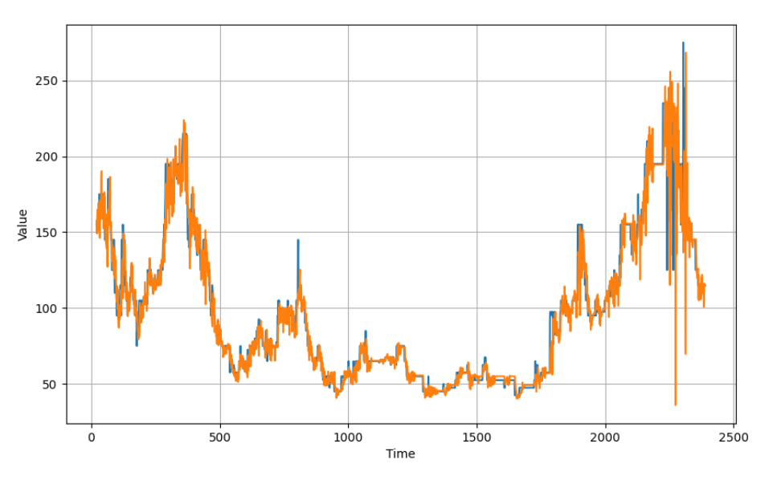

# Recurrent-Neural-Networks
Recurrent Neural Networks (RNN) are designed to work with sequential data. Sequential data(can be time-series) can be in form of text, audio, video etc. In RNN to train the network you backpropagate through time, at each step the gradient is calculated. The gradient is used to update weights in the network. If the effect of the previous layer on the current layer is small then the gradient value will be small and vice-versa. If the gradient of the previous layer is smaller then the gradient of the current layer will be even smaller. This makes the gradients exponentially shrink down as we backpropagate. Smaller gradient means it will not affect the weight updation. Due to this, the network does not learn the effect of earlier inputs. Thus, causing the short-term memory problem. Thus to address these problem other two RNNs are introduced. 
The Types of RNNs seen here are:
  <ul>Simple RNN</ul>
  <ul>LSTM</ul>
  <ul>GRU</ul>

LSTM - Long short term memory 
GRU - Gated recurrent units 

<h2>Simple RNN</h2>

<h2>GRU</h2>

<h2>LSTM</h2>

